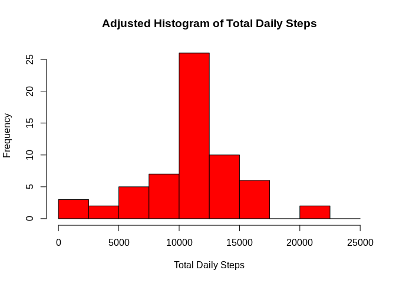

```r
echo = TRUE
```

## Loading and preprocessing the data

Here, we check for the presence of the data folder and data set, 
creating/unzipping if necessary, before loading the data into the environment 
using read.csv. The date column is converted to the date class. 


```r
# Check if data folder exists
if(!dir.exists('data/')) {
        dir.create('data/')
}
# Check if data file unzipped into data/
if(!file.exists('data/activity.csv')) {
        unzip('activity.zip', exdir = 'data/')
}

# Load the data
steps.data <- read.csv('data/activity.csv')

# Convert date column to date format
steps.data$date <- as.Date(steps.data$date, format = '%Y-%m-%d')
str(steps.data)
```

```
## 'data.frame':	17568 obs. of  3 variables:
##  $ steps   : int  NA NA NA NA NA NA NA NA NA NA ...
##  $ date    : Date, format: "2012-10-01" "2012-10-01" ...
##  $ interval: int  0 5 10 15 20 25 30 35 40 45 ...
```


## What is mean total number of steps taken per day?

Functions from the dplyr package are used to group the data by date, and find
the total sum of steps for each day. This data is represented in a histogram:

```r
library(dplyr)
```

```
## 
## Attaching package: 'dplyr'
```

```
## The following objects are masked from 'package:stats':
## 
##     filter, lag
```

```
## The following objects are masked from 'package:base':
## 
##     intersect, setdiff, setequal, union
```

```r
# Calculate total steps per day
total.steps <- 
        steps.data %>%
        group_by(date) %>%
        summarise(total.steps = sum(steps, na.rm = TRUE))

# Set mfrow, then produce histogram of total steps
par(mfrow=c(1,1))
hist(total.steps$total.steps,
     col = 'red',
     main = 'Histogram of Total Daily Steps',
     xlab = 'Total Daily Steps',
     breaks = seq(0, 25000, by = 2500))
```

<!-- -->

The mean and median can then be calculated from the total.steps data frame.


```r
mean(total.steps$total.steps)
```

```
## [1] 9354.23
```

```r
median(total.steps$total.steps)
```

```
## [1] 10395
```

## What is the average daily activity pattern?

The average steps for each interval can be calculated using the group_by and 
summarise functions from dplyr. The resulting data frame is then used to produce
a time series plot of daily activity, on average across all days.

```r
# Calculate average steps per 5 minute interval
avg.interval.steps <-
        steps.data %>%
        group_by(interval) %>%
        summarise(mean.steps = mean(steps, na.rm = TRUE))

# Plot time series of mean.steps per interval, on average across all days
plot(avg.interval.steps,
     type = 'l',
     col = 'blue',
     main = 'Average Number of Steps at 5 Minute Intervals',
     xlab = 'Interval',
     ylab = 'Number of Steps')
```

<!-- -->

Below, the interval which contains the highest average number of steps per day
is calculated and shown.


```r
# which.max function used to find position of highest average steps.
max.steps <- which.max(avg.interval.steps$mean.steps)
avg.interval.steps[max.steps, ]$interval
```

```
## [1] 835
```

## Imputing missing values

The sum and is.na functions are initially used to calculate and report the 
number of missing values in the dataset. 

```r
sum(is.na(steps.data))
```

```
## [1] 2304
```

To account for missing values in the dataset, any NA values are replaced with 
the average number of steps for that interval, calculated earlier. A new data
set is created using the transform function, along with ifelse inside the
function call.


```r
# New data set with NA values replaced by mean
full.steps.data <- transform(steps.data, steps = ifelse(is.na(steps.data$steps),
                                             yes = avg.interval.steps$mean.steps,
                                             no = steps.data$steps))
```

The total steps per day are re-calculated using the new data set with imputed 
values. 


```r
# Calculate total steps again using new data set
total.steps.full <-
        full.steps.data %>%
        group_by(date) %>%
        summarise(total.steps = sum(steps, na.rm = TRUE))

# Produce histogram with new daily totals
hist(total.steps.full$total.steps,
     col = 'red',
     main = 'Adjusted Histogram of Total Daily Steps',
     xlab = 'Total Daily Steps',
     breaks = seq(0, 25000, by = 2500))
```

<!-- -->

The mean and median values for the new data set


```r
mean(total.steps.full$total.steps)
```

```
## [1] 10766.19
```

```r
median(total.steps.full$total.steps)
```

```
## [1] 10766.19
```

The major difference between the adjusted histogram and the original is in the 
frequency of values between 0 and 2500. In the original histogram, values 
between 0 and 2500 were the second most common, seemingly because missing values
were being treated as 0. In the adjusted histogram, the frequency of values 
between 0 and 2500 is significantly reduced, and the frequency of all other 
bins.

## Are there differences in activity patterns between weekdays and weekends?

To answer this question, the data must initially be divided by weekday/weekend.
A factor variable of weekday or weekend is created and added to the data set 
under column heading 'wDay', using the weekdays function and a vector containing
weekday names.


```r
# character vector to hold weekday names
weekdays1 <- c('Monday', 'Tuesday', 'Wednesday', 'Thursday', 'Friday')

# Create factor variable to distinguish weekday from weekend
full.steps.data$wDay <- factor((weekdays(full.steps.data$date) %in% weekdays1),
                               levels = c(FALSE, TRUE),
                               labels = c('weekend', 'weekday'))
```

The average daily activity through weekdays and weekends can now be compared
by subsetting the data based on weekend or weekday in the 'wDay' column, 
grouping by interval and calculating the mean across the values. 


```r
# Weekday and weekend means per interval
avg.weekday <-
        full.steps.data %>%
        filter(wDay == 'weekday') %>%
        group_by(interval) %>%
        summarise(mean.steps = mean(steps, na.rm = TRUE))

avg.weekend <- 
        full.steps.data %>%
        filter(wDay == 'weekend') %>%
        group_by(interval) %>%
        summarise(mean.steps = mean(steps, na.rm = TRUE))
```

The daily activity is then plotted as a line graph using the base R plotting 
system. The mfrow parameter is altered to allow both plots to be shown in the 
same image.


```r
par(mfrow = c(2, 1))

plot(avg.weekday,
     type = 'l',
     col = 'green',
     main = 'Comparison of Mean Daily Steps by Weekdays and Weekends',
     xlab = 'Interval',
     ylab = 'Number of Steps')

plot(avg.weekend,
     type = 'l',
     col = 'purple',
     xlab = 'Interval',
     ylab = 'Number of Steps')
```

<!-- -->
